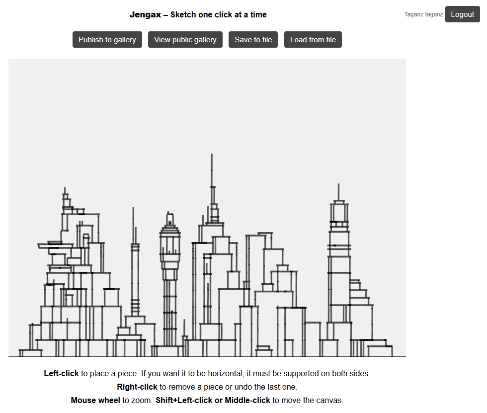

# Jengax  (work in progress)

**Jengax** is a browser-based interactive block-stacking sketch tool inspired by construction logic puzzles.  
Users can place vertical and horizontal rectangular pieces based on specific support rules.

    

## 🎮 How to Play

- **Left-click** to place a piece at the clicked position.
- **Right-click** to remove a specific piece or undo last piece addition
- Mouse wheel Zoom in/out the canvas under the cursor
- Arrow keys  Pan the canvas
- Hold Q to show current mouse coordinates
- S to save the current drawing to a JSON file
- L to load a drawing from a JSON file

## 🧠 Game Rules

- Vertical pieces rest on the ground or on the top of other pieces.
- Horizontal pieces can only be placed if two supporting vertical pieces are aligned and close enough.

## 🛠 Built With

- [p5.js](https://p5js.org/) for rendering and interaction.
- Vanilla JavaScript and HTML5.

## 🌐 Live Demo

You can play the game online here:  
👉 [https://rdalmau.com/jengax/](https://rdalmau.com/jengax/)

## inbox 
// JENGAX 
// A simple sketching tool inspired by Townscaper and Jenga
// Ricard Dalmau, 2025
// github: https://github.com/taganz/jengax
// --------------------------------------------------
// Left-click to place a piece at the clicked position.
// Right-click to remove a specific piece or undo last piece addition
// Mouse wheel Zoom in/out the canvas under the cursor
// Arrow keys Pan the canvas
// Hold Q to show current mouse coordinates
// S to save the current drawing to a JSON file
// L to load a drawing from a JSON file
// Vertical pieces rest on the ground or on the top of other pieces.
// Horizontal pieces can only be placed if two supporting vertical pieces are aligned and close enough.

